# Ant Core

Developer map: [Firmware architecture and safety invariants](docs/architecture.md).

Ant Core supports the Seeed XIAO ESP32-S3 Sense and XIAO ESP32-C3 from one codebase. Both builds provide three DRV8837 DC motor outputs, two servo headers, optional external BMI270 telemetry, BLE Xbox controller input, a web control panel, OTA updates, profiles, battery pack notes, and persistent blackbox logging. Camera/FPV and analog battery monitoring are available only on S3 Sense. C3 preserves the PCB pin assignments and disables both features.

**C3 startup needs attention on the supplied Rev 3.0 PCB:** D9/GPIO9 must be high at reset and directly drives U7, whose nSLEEP is tied high. Motor 3 can run before firmware takes control. The firmware now keeps the original wiring and divider, but cannot prevent this reset-time electrical behavior. See [C3 compatibility and schematic findings](docs/board-compatibility.md). Physical C3 operation still needs bench validation.

The firmware is built around a conservative safety model: the robot boots disarmed, output pins are driven safe, mutating web actions require an authenticated admin session, live output tests are gated, and arming is blocked by unsafe states such as critical battery, pit mode, mapping-test mode, OTA, bench mode, invalid config, missing control source, or the default admin PIN when authentication is enabled.

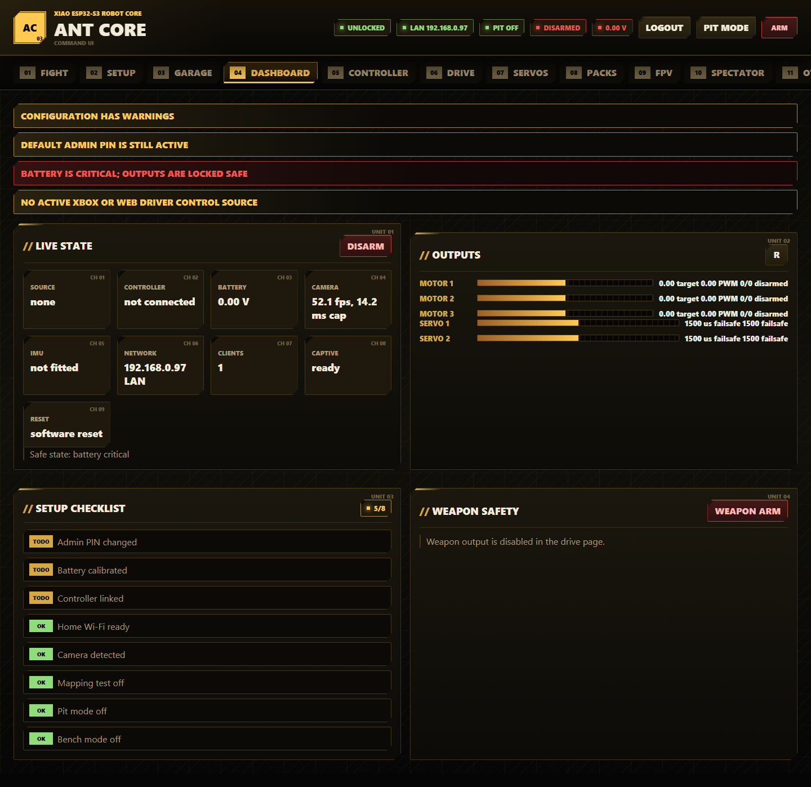

Screenshots in this README are real captures of the shipped `data/index.html`, `data/app.css`, and `data/app.js` web UI running with the project's mock telemetry harness. Hardware values, camera frames, and saved profiles will differ on a live board.

## Table Of Contents

- [Hardware](#hardware)
- [Default Access](#default-access)
- [Install, Build, And Upload](#install-build-and-upload)
- [First Run Commissioning](#first-run-commissioning)
- [Safety, Status, And Network Features](#safety-status-and-network-features)
- [Web UI Feature Guide](#web-ui-feature-guide)
- [Serial And Test Tools](#serial-and-test-tools)
- [Validation](#validation)
- [Project Layout](#project-layout)
- [Troubleshooting](#troubleshooting)

## Hardware

Target board:

- Seeed XIAO ESP32-S3 Sense
- Seeed XIAO ESP32-C3 with the [C3 feature limits and startup considerations](docs/board-compatibility.md)
- Arduino framework through PlatformIO
- LittleFS web filesystem
- BLE Xbox controller support
- XIAO Sense camera used for FPV on port `81`

Main Ant Core I/O (same pins on both boards; C3 leaves D8 unused):

| XIAO pin | Ant Core function | Notes |
| --- | --- | --- |
| D0 / D1 | Motor 1 A/B | DRV8837 drive output |
| D2 / D3 | Motor 2 A/B | DRV8837 drive output |
| D4 / D5 | I2C SDA/SCL | Optional BMI270 IMU |
| D6 / D7 | Servo 1 / Servo 2 | Configurable pulse limits and failsafe |
| D8 | 2S LiPo sense | 20k top, 10k bottom divider, default multiplier `3.0` |
| D9 / D10 | Motor 3 A/B | Usually weapon motor output |

Read the detailed wiring notes before powering hardware:

- [Pinout](docs/pinout.md)
- [Wiring and safety checklist](docs/wiring-and-safety.md)
- [Controller setup](docs/controller-setup.md)
- [Battery calibration](docs/battery-calibration.md)
- [OTA and recovery](docs/ota-and-recovery.md)

## Default Access

| Item | Default |
| --- | --- |
| Access point | `AntCore-XXXX` |
| AP password | `antcore123` |
| AP setup URL | `http://192.168.4.1/` |
| mDNS URL | `http://antcore.local/` |
| Admin PIN | `antcore` |
| Serial baud | `115200` |

Change the admin PIN and AP password before driving near people. With authentication enabled, arming is blocked while the admin PIN is still the default.

Development Wi-Fi credentials can be kept out of source control by copying `include/antcore_local_secrets.example.h` to `include/antcore_local_secrets.h` and editing the local macros.

## Install, Build, And Upload

The default environment remains `seeed_xiao_esp32s3`. For C3, select its environment explicitly for **both** firmware and filesystem:

```powershell
pio run -e seeed_xiao_esp32c3
pio run -e seeed_xiao_esp32c3 --target upload
pio run -e seeed_xiao_esp32c3 --target uploadfs
pio device monitor -e seeed_xiao_esp32c3
```

Use `seeed_xiao_esp32s3` for S3 Sense. These are different firmware binaries for different CPUs; uploading the S3 binary does not turn it into a C3 build. Never mix filesystem images either: their partition sizes differ.

1. Install Python and PlatformIO.
2. Install the project Python tools:

```powershell
python -m pip install -r requirements.txt
```

3. Build the firmware:

```powershell
pio run
```

4. Upload firmware over USB:

```powershell
pio run --target upload
```

5. Upload the LittleFS web interface:

```powershell
pio run --target uploadfs
```

6. Open the serial monitor if you want boot logs:

```powershell
pio device monitor
```

PlatformIO normally auto-detects the XIAO ESP32-S3 serial port. If more than one board is connected, pass the port explicitly, for example:

```powershell
pio run --target upload --upload-port COM7
pio run --target uploadfs --upload-port COM7
```

## First Run Commissioning

Do this with the robot restrained, wheels clear, and the weapon made safe.

1. Remove the safety link.
2. Connect USB.
3. Upload firmware and LittleFS web assets.
4. Join the `AntCore-XXXX` Wi-Fi network.
5. Open the captive portal, `http://192.168.4.1/`, or `http://antcore.local/`.
6. Log in with the admin PIN.
7. Change the admin PIN and AP password in Diagnostics -> Security.
8. Check battery voltage in Diagnostics -> Battery.
9. Calibrate battery voltage against a multimeter.
10. Pair an Xbox controller or use FPV -> TAKE for browser control.
11. Configure drive, weapon, servo, and action mappings.
12. Use the Drive Direction Wizard to record left/right wheel direction.
13. Use Diagnostics -> Output Test only when the robot is physically safe.
14. Save a named profile.
15. Export the config backup.
16. Enable pit mode whenever the robot is in the pits or on the bench.
17. Fit the safety link only when ready for a controlled live test.

## Safety, Status, And Network Features

These features are used across multiple pages and are easy to miss if you only read one tab section.

### Arming And Output Safety

1. Ant Core boots disarmed and writes motor outputs low.
2. Robot arming is blocked when authentication is enabled and the admin PIN is still the default.
3. Robot arming is blocked by invalid config, pit mode, controller mapping test mode, OTA, USB bench mode, critical battery, or no fresh control source when that requirement is enabled.
4. Runtime safety disarms the robot on pit mode, mapping test mode, bench mode, stale web control, stale Xbox input, or control link loss.
5. Weapon arming is separate from robot arming. The weapon can only arm when the robot is armed and the weapon output is enabled.
6. Robot disarm clears weapon output, motor targets, self-right activity, gyro heading hold, and servo toggle latches.
7. Live output tests require admin login, live-output enable, robot arm, and a safe physical setup.
8. Serial live output tests require `LIVE_OUTPUT_ENABLE 1` or the serial bridge `--live-output` flag.

### Admin Sessions And Secret Handling

1. Press `Login` to create an admin session token.
2. Mutating web actions send that token in the `X-AntCore-Token` header.
3. Press `Logout` to clear the browser token.
4. Admin PIN, AP password, and station password are write-only in the browser.
5. `/api/config` reports whether secrets are set, but password fields come back blank.
6. Leave password fields blank when saving if you want to keep the stored secret.
7. Change both the admin PIN and AP password before running at an event.

### Control Source Ownership

1. Xbox BLE and browser FPV controls are competing driver sources.
2. The browser must press `TAKE` on the FPV page to hold the web driver lock.
3. Only the browser with the web driver lock can send drive frames.
4. Multiple dashboard clients are shown as diagnostics; they do not by themselves block arming.
5. Use `FREE`, close the page, or hide the page to release web control.
6. Use Dashboard or Controller -> Live Inspector to check source, web lock, web clients, and signal health.

### Config Validation

1. Ant Core validates the current config after load, import, and save.
2. Errors make the config invalid and block arming.
3. Warnings are shown in Dashboard banners and Diagnostics -> Config Health.
4. Examples of warnings include missing BMI270 for gyro features, calibration disabled, mapping test mode enabled, battery safety disabled, pit mode enabled, no fresh-control-source requirement, admin PIN protection disabled, default admin PIN, or short AP password.
5. Fix validation errors before a live test.
6. Treat warnings as event-prep tasks unless you intentionally enabled that behavior for bench work.

### Captive Portal, AP, LAN, And mDNS

1. The Ant Core access point stays available as a setup fallback.
2. Captive portal DNS is enabled on the AP when possible, so phones and laptops should open the setup UI after joining `AntCore-XXXX`.
3. If the captive portal does not open, browse to `http://192.168.4.1/`.
4. The Setup page includes an offline QR code for the AP setup URL.
5. Station mode can join a trusted Wi-Fi network for LAN debugging.
6. When LAN is connected, use the shown LAN IP or `http://antcore.local/` where mDNS is supported.
7. Dashboard shows AP/LAN state, captive DNS state, connected clients, and reset reason.

### Status LED Codes

The XIAO red power/charge LED is hardware-controlled. Firmware drives the available status LED pattern:

| Pattern | Meaning |
| --- | --- |
| Rapid flash | Firmware is alive but still booting |
| Fast flash | Joining configured Wi-Fi |
| Solid on | Connected to configured Wi-Fi |
| Double pulse | AP-only or AP fallback mode |
| Triple pulse | Safe boot, peripheral failure, or recovery state |
| Very fast flash | Robot is armed and outputs may be live |
| Fastest flash | OTA or restart in progress; do not remove power |

### Visual-Only Fight Effects

1. Fight Mode uses visual countdown and warning effects only.
2. The project intentionally does not add sound or audio effects.
3. Browser visual effects respect reduced-motion preferences where supported.

## Web UI Feature Guide

The main UI has twelve tabs:

`Fight`, `Setup`, `Garage`, `Dashboard`, `Controller`, `Drive`, `Servos`, `Packs`, `FPV`, `Spectator`, `OTA`, and `Diagnostics`.

### Header Controls

Every normal page shows the status header.

1. Read the status badges: auth, network, pit mode, arm state, and battery.
2. Press `Login` and enter the admin PIN before changing settings.
3. Press `Pit Mode` to lock live outputs while configuring or waiting in the pits.
4. Press `ARM` only after the setup checklist is clear and a fresh control source is present.
5. Use any `Disarm` or emergency disarm button to stop outputs immediately.

### Fight

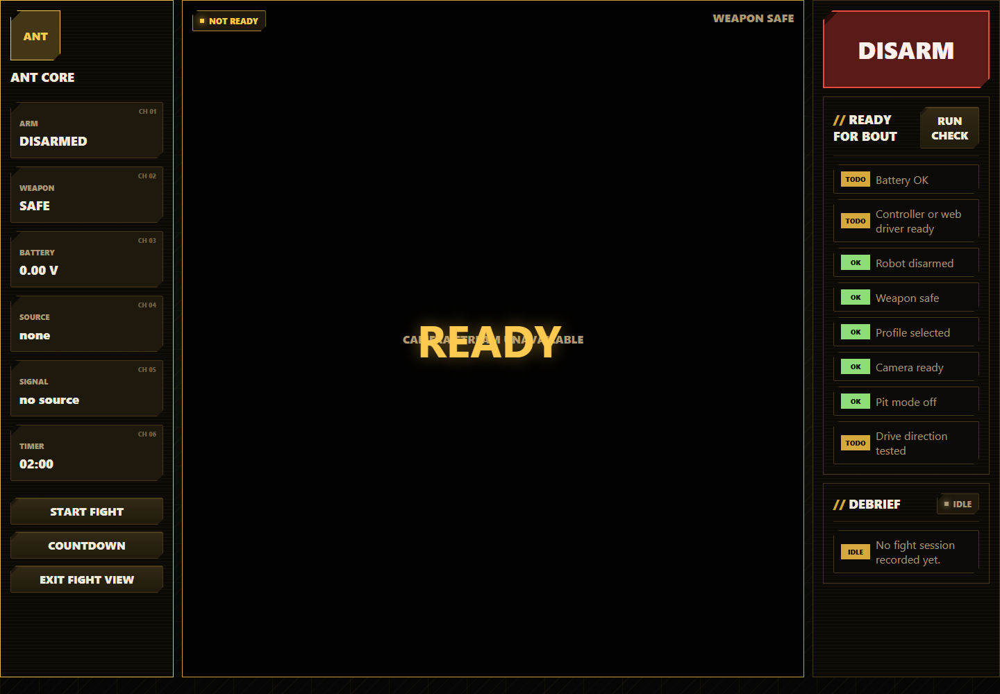

Fight Mode is the simplified bout view. It hides configuration controls and keeps the combat information visible.

1. Open `Fight`.
2. Press `Run Check` in Ready For Bout.
3. Confirm battery, controller or web driver, pit mode, profile, camera, weapon safety, and drive direction are ready.
4. Press `Countdown` for a visual countdown, or `Start Fight` to start the match timer immediately.
5. Watch arm state, weapon state, battery, timer, control source, and signal health.
6. Press the large `DISARM` button if anything behaves unexpectedly.
7. Press `Exit Fight View` to return to the normal tabbed UI.
8. Review Debrief after the fight for duration, lowest battery, disconnects, failsafes, weapon arm events, reset reason, and recent logs.

### Setup

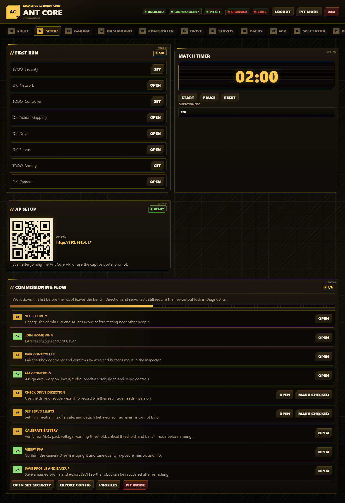

Setup is the first-run commissioning flow.

1. Open `Setup`.
2. Work through the First Run and Commissioning Flow cards from top to bottom.
3. Use the progress meter to find incomplete setup items.
4. Use `Open Next Step` to jump to the next page that needs attention.
5. Use the AP QR code after joining the Ant Core AP to open `http://192.168.4.1/` from a phone.
6. Use the Match Timer for local bench or fight timing.
7. Press `Export Config` after commissioning so you can restore settings after reflashing.
8. Press `Profiles` to jump to profile management in Diagnostics.
9. Press `Pit Mode` before bench work or event-pit handling.

Use the Match Timer:

1. Enter `Duration sec` between the supported limits.
2. Press `Start` to begin counting down.
3. Press `Pause` to stop the timer without clearing the remaining time.
4. Press `Reset` to return to the configured duration.
5. The same timer value is reused by Fight Mode and Spectator display.

### Garage

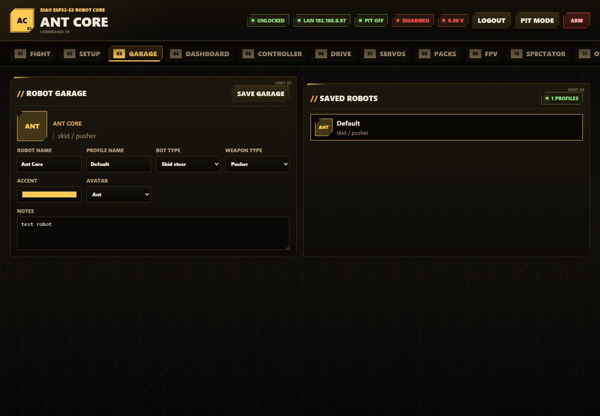

Garage stores robot metadata alongside the active config/profile.

1. Open `Garage`.
2. Enter the robot name.
3. Enter the profile name.
4. Choose bot type: skid steer, invertible, wedge, control bot, or experimental.
5. Choose weapon type: pusher, vertical spinner, horizontal spinner, flipper, grabber, or lifter.
6. Choose an accent colour and avatar.
7. Add event or build notes.
8. Press `Save Garage`.
9. Use Saved Robots to select stored profile cards when profiles exist on the board.

Garage field reference:

| Field | What it controls |
| --- | --- |
| `Robot Name` | Name shown on Dashboard, Fight, Spectator, and exported configs |
| `Profile Name` | Name used when saving/loading a robot setup |
| `Bot Type` | Metadata: skid steer, invertible, wedge, control bot, or experimental |
| `Weapon Type` | Metadata and preset hint: pusher, vertical spinner, horizontal spinner, flipper, grabber, or lifter |
| `Accent` | UI accent colour for robot avatar cards |
| `Avatar` | Short avatar label: ant, wedge, spinner, claw, bolt, or shield |
| `Notes` | Short build or event notes stored with the config/profile |

### Dashboard


Dashboard is the normal operating overview.

1. Read safety banners first. They explain why arming is blocked.
2. Check Live State for source, controller, battery, camera, IMU, network, clients, captive portal, and reset reason.
3. Use `Disarm` to force safe output at any time.
4. Review Outputs for requested output, ramped output, PWM duty, and failsafe override state for all motors and servos.
5. Use `Refresh` if you need an immediate status poll.
6. Review Setup Checklist until all items are OK.
7. Use Weapon Safety to arm or safe the weapon, but only after the robot itself is armed and the weapon is enabled.

### Controller

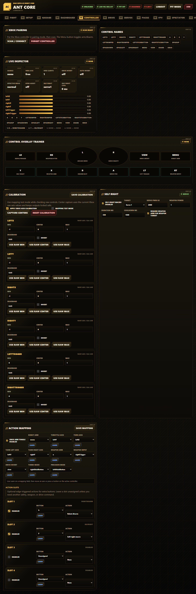

Controller manages Xbox BLE pairing, mapping, calibration, self-right, and action slots.

Pair an Xbox controller:

1. Open `Controller`.
2. Log in.
3. Press `Scan / Connect`.
4. Put the Xbox controller into pairing mode.
5. Wait for Live Inspector to show live axes and buttons.
6. Press `Forget Controller` only when you need to clear BLE bonds and pair again.

Inspect controls:

1. Use Control Names to see every supported axis and button name.
2. Watch Live Inspector for source, web lock, web clients, drive invert, effective invert, gyro assist, self-right target, and cooldown.
3. Use Control Overlay Trainer to see which physical buttons currently map to drive, weapon, self-right, invert, turbo, precision, and servo actions.

Calibrate axes:

1. Enable `apply Xbox axis calibration`.
2. Enable `mapping test mode` when you want to inspect controls with arming and outputs locked safe.
3. Leave sticks and triggers centered.
4. Press `Capture Centers`.
5. Move each axis to its limits and use the raw min/max buttons if needed.
6. Adjust deadband and invert per axis.
7. Press `Save Calibration`.
8. Turn mapping test mode off before trying to arm.
9. Press `Reset Calibration` only when you want to restore all axis min, center, max, deadband, and invert values to defaults.

Configure self-right:

1. Enable `self-right macro enabled`.
2. Choose target: Servo 1, Servo 2, or weapon motor.
3. Set servo pulse or weapon power.
4. Set duration and cooldown.
5. Decide whether weapon-target self-right requires weapon arm.
6. Save mapping/config.
7. Assign `Self-right macro` to an action slot or button mapping.

Self-right field reference:

| Field | What it controls |
| --- | --- |
| `Target` | Output used by the macro: Servo 1, Servo 2, or weapon motor |
| `Servo PWM us` | Pulse sent when the target is a servo |
| `Weapon Power` | Signed motor power sent when the target is the weapon motor |
| `Duration ms` | How long the macro output stays active |
| `Cooldown ms` | Minimum time before the macro can run again |
| `require weapon arm for weapon target` | Keeps weapon-target self-right behind the dedicated weapon arm state |

Configure action mapping:

1. Enable or disable Xbox arm toggle.
2. Choose the Robot Arm button.
3. Set throttle, turn, tank-left, and tank-right axes.
4. Set Weapon Arm and Weapon Input.
5. Set Drive Invert, Turbo Mode, and Precision Mode buttons.
6. Press `Learn` next to a field, then move the target axis or press the target button.
7. Configure Action Slots 1-4 if you need extra button-triggered actions.
8. Available action-slot actions are none, robot arm toggle, robot disarm, weapon arm toggle, weapon safe, drive invert toggle, and self-right macro.
9. Press `Save Mapping`.

### Drive And Weapon

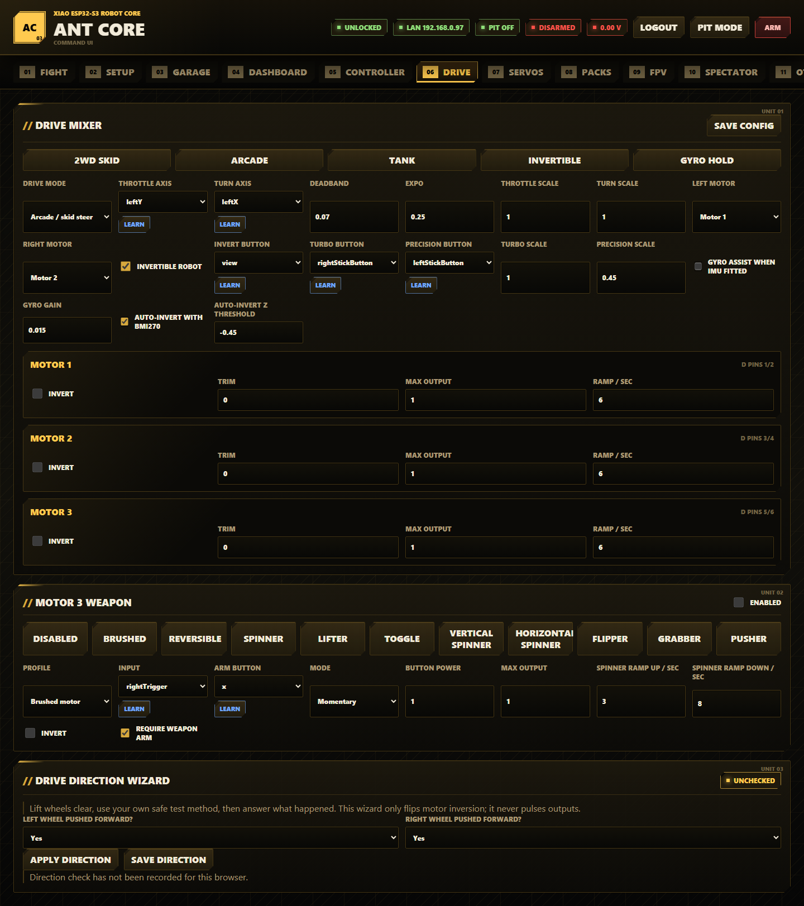

Drive configures the drive mixer, motor limits, weapon motor, and drive direction.

Use drive presets:

1. Open `Drive`.
2. Pick a preset first: `2WD Skid`, `Arcade`, `Tank`, `Invertible`, or `Gyro Hold`.
3. Adjust individual fields after applying the preset.
4. Press `Save Config`.

Configure the mixer:

1. Choose Drive Mode: arcade/skid steer or tank.
2. Pick throttle and turn axes for arcade drive.
3. Pick left and right tank axes for tank drive.
4. Set deadband to ignore stick noise.
5. Set expo for softer low-stick response.
6. Set throttle and turn scale.
7. Choose which motor drives the left side and right side.
8. Enable invertible robot if the robot can run upside down.
9. Choose invert, turbo, and precision buttons.
10. Set turbo and precision scales.
11. Enable gyro assist only when the BMI270 is fitted and mounted securely.
12. Enable auto-invert with BMI270 only after confirming the board orientation.
13. Tune `Auto-Invert Z Threshold` only if the board mounting angle needs a different upside-down detection threshold.

Drive field reference:

| Field | What it controls |
| --- | --- |
| `Drive Mode` | Arcade/skid steer mixing or tank drive |
| `Throttle Axis` / `Turn Axis` | Main arcade drive inputs |
| `Tank Left Axis` / `Tank Right Axis` | Independent side inputs for tank mode |
| `Deadband` | Stick range ignored around center |
| `Expo` | Softer response near center while retaining full range |
| `Throttle Scale` / `Turn Scale` | Maximum normal throttle and turn authority |
| `Left Motor` / `Right Motor` | Motor outputs assigned to each drive side |
| `Invert Button` | Button used to flip driver direction manually |
| `Turbo Button` / `Precision Button` | Buttons used to change drive scaling while held or active |
| `Turbo Scale` / `Precision Scale` | Output scale for the turbo and precision modes |
| `Gyro Gain` | Heading-hold correction strength when gyro assist is active |

Configure motor outputs:

1. Review Motor 1, Motor 2, and Motor 3 rows.
2. Use invert to correct direction in firmware instead of rewiring.
3. Use trim as proportional output compensation: +0.10 adds 10% to a nonzero command; neutral remains zero. Retune values saved before the modular refactor, which used an offset.
4. Use max output to cap power.
5. Use ramp rate to soften acceleration.
6. Save config.

Configure Motor 3 weapon:

1. Choose a weapon preset: Disabled, Brushed, Reversible, Spinner, Lifter, Toggle, Vertical Spinner, Horizontal Spinner, Flipper, Grabber, or Pusher.
2. Enable the weapon only if Motor 3 is wired to a safe weapon output.
3. Choose profile: brushed motor, spinner, lifter/flipper, or reversible weapon.
4. Choose input and arm button.
5. Choose momentary or toggle mode.
6. Set button power and max output.
7. Set spinner ramp-up and ramp-down rates for high-inertia weapons.
8. Set invert if the weapon direction is wrong.
9. Keep `require weapon arm` enabled for event use.
10. Save config.

Weapon mode reference:

| Field | What it controls |
| --- | --- |
| `Profile` | Brushed motor, spinner, lifter/flipper, or reversible weapon behavior |
| `Input` | Axis or button that commands weapon output |
| `Arm Button` | Dedicated button used to toggle weapon arm state |
| `Mode` | Momentary or toggle command behavior |
| `Button Power` | Output used for button-style weapon input |
| `Max Output` | Absolute cap on weapon output |
| `Spinner Ramp Up / sec` | Acceleration limit for spinner-style outputs |
| `Spinner Ramp Down / sec` | Deceleration limit for spinner-style outputs |
| `invert` | Reverses weapon motor direction |
| `require weapon arm` | Requires the separate weapon arm state before output can run |

Use the Drive Direction Wizard:

1. Lift the wheels clear.
2. Use your own safe low-power test method to observe wheel direction.
3. For each side, answer whether the wheel was pushed forward.
4. Press `Apply Direction` to flip inversion locally.
5. Press `Save Direction` to persist it.
6. The wizard only updates inversion settings; it does not pulse motors itself.

### Servos

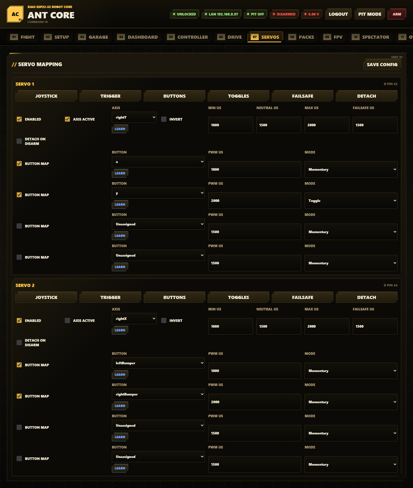

Servos configures Servo 1 and Servo 2 control, limits, button positions, and failsafe behavior.

1. Open `Servos`.
2. Pick a servo preset: joystick proportional, trigger proportional, button positions, toggle positions, failsafe hold, or detach on disarm.
3. Enable the servo only after pulse limits are safe.
4. Choose axis mode if you want proportional control.
5. Select the axis and invert if required.
6. Set min, neutral, max, and failsafe pulse widths.
7. Enable detach-on-disarm only when the mechanism is safe without holding torque.
8. Configure button positions for momentary or toggle-latched servo commands.
9. Keep toggle positions for deliberate latch use only; robot disarm clears toggle latches back to safe behavior.
10. Press `Save Config`.
11. Test travel from Diagnostics -> Output Test with linkages disconnected first.

### Packs

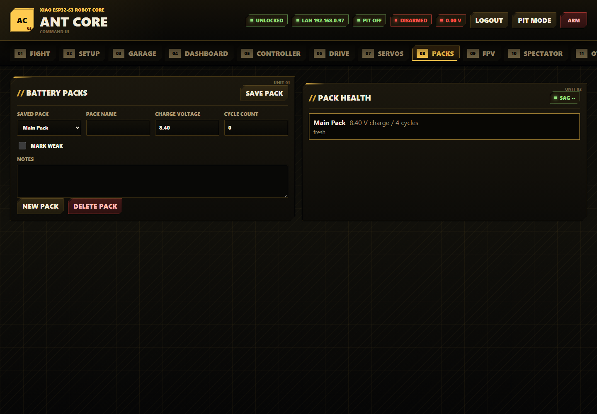

Packs stores battery pack notes on the board.

1. Open `Packs`.
2. Press `New Pack` or select an existing pack.
3. Enter pack name.
4. Enter charge voltage.
5. Enter cycle count.
6. Mark weak packs when they sag or should not be used for hard fights.
7. Add notes.
8. Press `Save Pack`.
9. Read Pack Health for the saved pack list and live sag calculation.
10. Press `Delete Pack` only for the selected pack you no longer need.

Pack field reference:

| Field | What it controls |
| --- | --- |
| `Saved Pack` | Pack selected for editing |
| `Pack Name` | Human-readable pack name |
| `Charge Voltage` | Voltage the UI uses as the full-charge baseline |
| `Cycle Count` | Manual cycle tracking field |
| `mark weak` | Flags packs that sag or should be avoided for hard use |
| `Notes` | Short condition or event notes |

### FPV

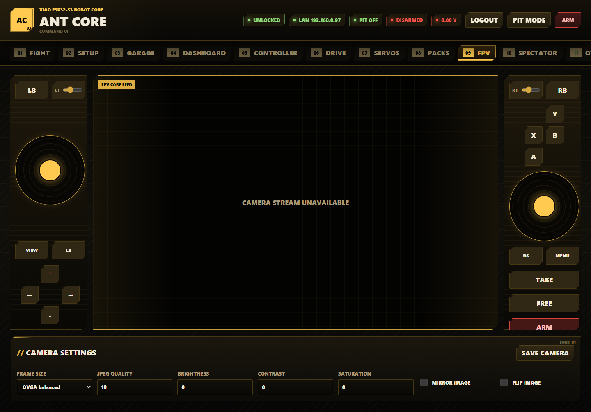

FPV combines the camera stream with a browser virtual gamepad.

Take web control:

1. Open `FPV`.
2. Log in.
3. Press `TAKE` to claim the web driver lock.
4. Use the left and right virtual sticks, bumpers, face buttons, D-pad, View/Menu, stick-click buttons, and trigger sliders.
5. Press `ARM` only after the same safety checks you would use for Xbox control.
6. Press `FREE` to release web control.
7. Leaving or hiding the page releases web control shortly after.

Use camera settings:

1. Choose frame size: QQVGA low latency, QVGA balanced, or VGA detail.
2. Set JPEG quality.
3. Adjust brightness, contrast, and saturation.
4. Enable mirror or flip if the camera is mounted differently.
5. Press `Save Camera`.

Control freshness:

- Browser frames older than 250 ms command neutral output.
- A missing web driver heartbeat for 750 ms forces disarm.
- Only the browser holding the web driver lock can drive.

### Spectator

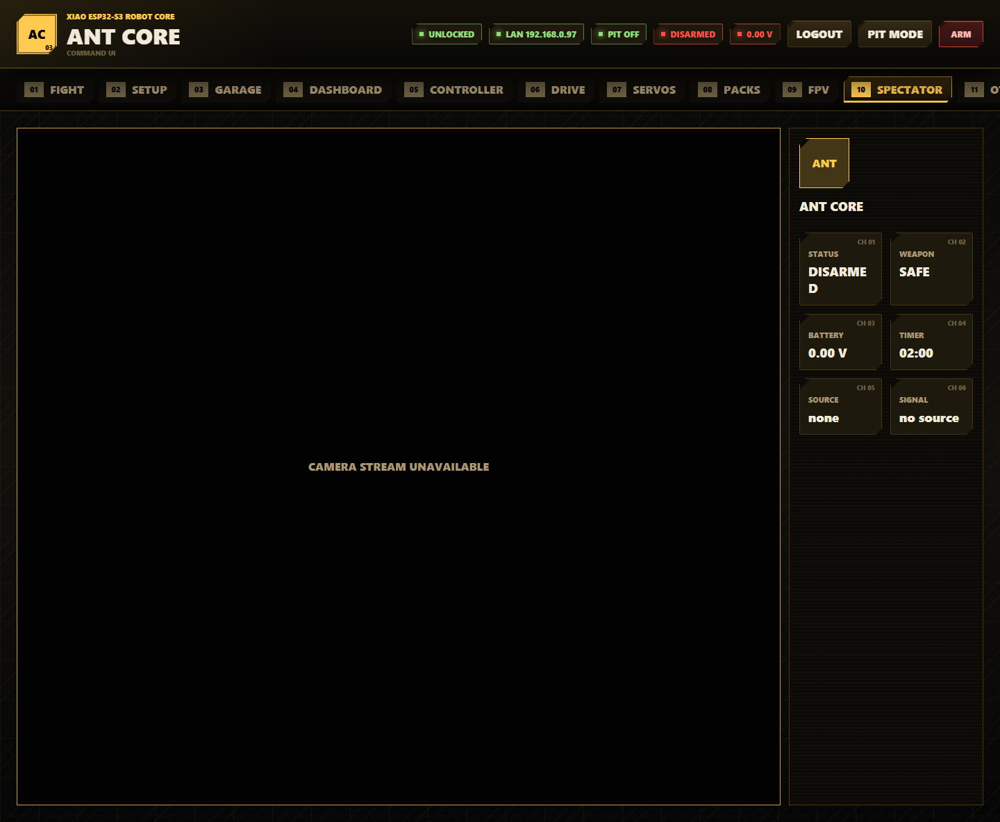

Spectator is a read-only pit or audience display.

1. Open `Spectator` from a phone, tablet, or laptop.
2. View robot avatar, name, FPV, timer, arm state, weapon state, battery, source, and signal health.
3. Do not expect arm, drive, or configuration controls on this page.
4. Use it for event display or pits where read-only visibility is useful.

### OTA

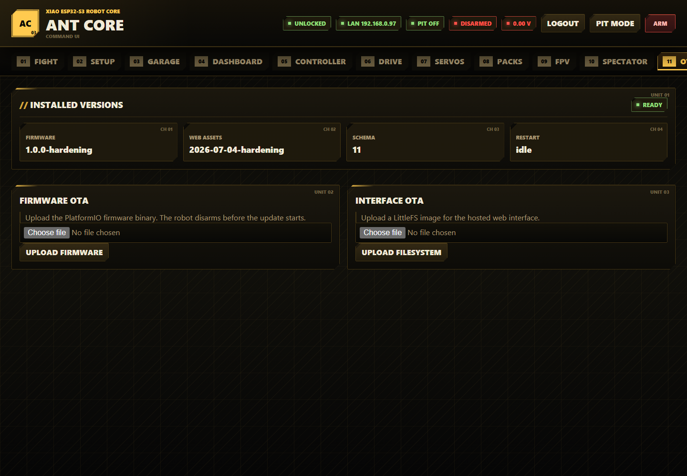

OTA updates firmware or web assets without opening the robot.

Installed Versions:

1. Read `Firmware` before uploading a new firmware binary.
2. Read `Web Assets` before uploading a new LittleFS image.
3. Read `Schema` to confirm the config schema expected by the running firmware.
4. Read `Restart` to see whether an update or config action has a pending reboot/restart state.

Before OTA:

1. Remove the weapon belt or otherwise make the weapon safe.
2. Put the robot on a stand.
3. Confirm the battery is not near critical.
4. Log in.
5. Keep the browser open until upload finishes.

Firmware OTA:

1. Build firmware:

```powershell
pio run
```

2. Open `OTA`.
3. Choose `.pio/build/seeed_xiao_esp32s3/firmware.bin`.
4. Press `Upload Firmware`.
5. Wait for success and reboot.
6. Reconnect through `antcore.local`, the LAN IP, or the AP.

Filesystem OTA:

1. Build LittleFS:

```powershell
pio run --target buildfs
```

2. Open `OTA`.
3. Choose `.pio/build/seeed_xiao_esp32s3/littlefs.bin`.
4. Press `Upload Filesystem` in the Interface OTA card.
5. Wait for reboot.
6. Hard-refresh the browser if assets look stale.

Upload firmware and filesystem as separate operations.

### Diagnostics

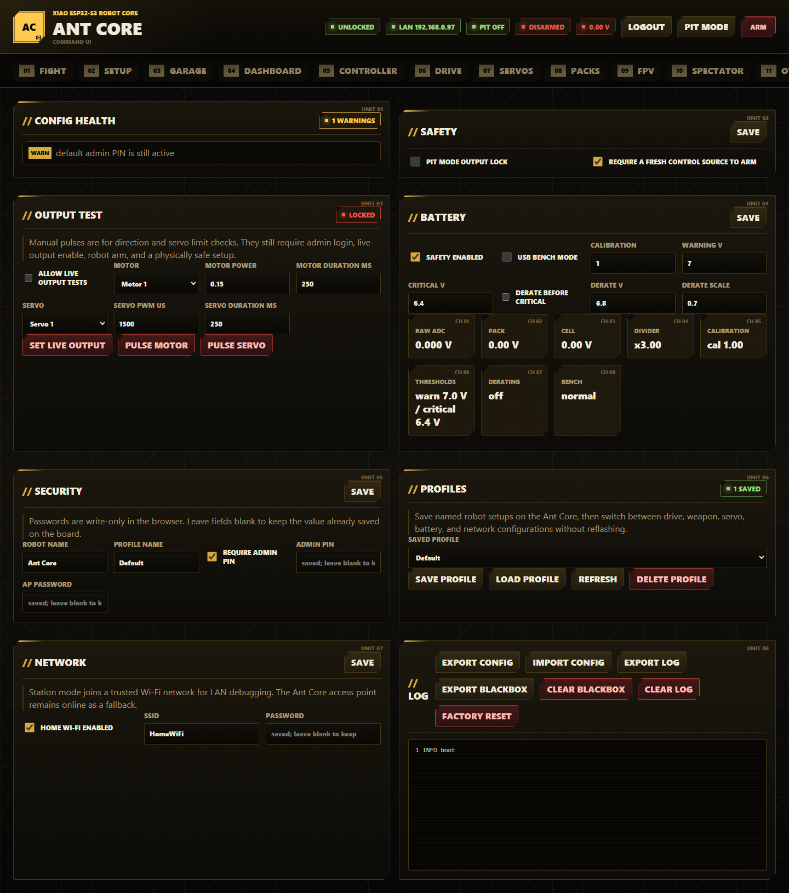

Diagnostics contains safety settings, live output tests, battery calibration, security, profiles, network settings, logs, blackbox export, config import/export, and factory reset.

Config Health:

1. Open `Diagnostics`.
2. Read Config Health before arming.
3. Fix errors before attempting live operation.
4. Treat warnings as setup items to resolve before event use.

Safety:

1. Enable `pit mode output lock` while working in the pits.
2. Keep `require a fresh control source to arm` enabled for normal use.
3. Press `Save`.

Output Test:

1. Make the robot physically safe: wheels clear, weapon disabled, linkages safe.
2. Log in.
3. Arm only when safe.
4. Enable `allow live output tests`.
5. Press `Set Live Output`.
6. Choose `Motor`, `Motor Power`, and `Motor Duration ms`.
7. Press `Pulse Motor` only after confirming the prompt.
8. Choose `Servo`, `Servo PWM us`, and `Servo Duration ms`.
9. Press `Pulse Servo` only after confirming the prompt.
10. Disable live output tests when finished.
11. Turn pit mode back on for bench work.

Battery:

1. Enable battery safety for event use.
2. Enable USB bench mode only when no LiPo is fitted and outputs are safe.
3. Measure pack voltage with a trusted multimeter.
4. Compare it to the displayed pack voltage.
5. Calculate new calibration:

```text
new calibration = old calibration * measured voltage / displayed voltage
```

6. Enter calibration.
7. Set warning, derate, and critical thresholds.
8. Enable derating if you want output scaling before critical disarm.
9. Press `Save`.

Battery field and readout reference:

| Field or readout | Meaning |
| --- | --- |
| `safety enabled` | Enables low-voltage warning, derating, critical arming block, and critical disarm |
| `USB bench mode` | Blocks arming for USB-only setup without a LiPo |
| `Calibration` | Multiplier correction after comparing with a multimeter |
| `Warning V` | Voltage where warnings and logs begin |
| `Critical V` | Voltage where arming is blocked and the robot disarms |
| `derate before critical` | Enables output scaling before the critical threshold |
| `Derate V` | Voltage where derating begins |
| `Derate Scale` | Output scale applied while derating |
| `Raw ADC` | Voltage seen by the ADC pin before divider math |
| `Pack` / `Cell` | Calculated pack and per-cell voltage |
| `Divider` | Fixed divider multiplier, normally `x3.00` |
| `Thresholds` | Current warning and critical thresholds |
| `Derating` / `Bench` | Current derating and bench-mode state |

Security:

1. Set Robot Name and Profile Name.
2. Leave `require admin PIN` enabled for normal use.
3. Enter a non-default admin PIN.
4. Enter a non-default AP password.
5. Leave password fields blank to keep already saved values.
6. Press `Save`.

Profiles:

1. Enter the desired active profile name in Security or Garage.
2. Press `Save Profile` to store the current board config.
3. Choose a profile from Saved Profile.
4. Press `Load Profile` to switch setups; loading disarms the robot.
5. Press `Refresh` to reload the profile list.
6. Press `Delete Profile` only for a profile you no longer need.

Network:

1. Enable home Wi-Fi for LAN debugging.
2. Enter `SSID` and `Password`.
3. Press `Save`.
4. Reconnect through the LAN IP or `http://antcore.local/` when station mode joins successfully.
5. The Ant Core AP remains available as fallback.

Logs, blackbox, and config files:

1. Press `Export Config` after setup or before factory reset.
2. Press `Import Config` and select a JSON backup to restore settings.
3. Press `Export Log` for the current browser-visible diagnostic log.
4. Press `Export Blackbox` for the persistent LittleFS blackbox log.
5. Press `Clear Blackbox` only after exporting data you need.
6. Press `Clear Log` to clear the diagnostic log.
7. Press `Factory Reset` to restore defaults; this disarms the robot and requires commissioning again.

## Serial And Test Tools

Install requirements first:

```powershell
python -m pip install -r requirements.txt
```

### Serial Bridge

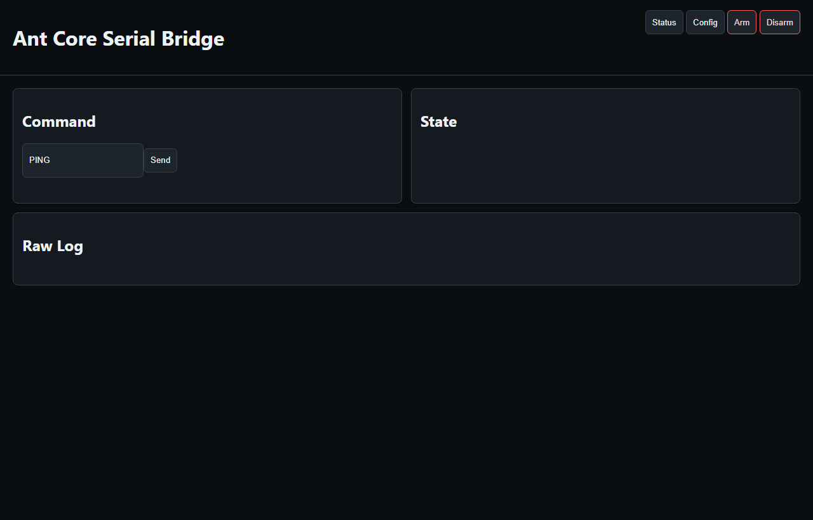

Use the serial bridge for command-line status, smoke tests, and a local serial dashboard.

```powershell
python tools/antcore_serial_bridge.py --smoke
python tools/antcore_serial_bridge.py --serve
```

If multiple serial devices are connected:

```powershell
python tools/antcore_serial_bridge.py --port COM7 --smoke
```

Live output smoke tests are intentionally separate:

```powershell
python tools/antcore_serial_bridge.py --smoke --live-output
```

Only use `--live-output` when the robot is physically safe.

Supported serial commands:

```text
PING
HELP
STATUS
CONFIG?
ARM
DISARM
WEAPON_ARM
WEAPON_DISARM
PIT_MODE <0|1>
BLE_SCAN
BLE_FORGET
WIFI_RECONNECT
RESET_CONFIG
LIVE_OUTPUT_ENABLE <0|1>
MOTOR_TEST <1-3> <-1..1> <ms>
SERVO_TEST <1-2> <us> <ms>
```

### UI Audit

Run the mock browser audit:

```powershell
python tools/antcore_ui_audit.py
```

Run a layout audit against a live board:

```powershell
python tools/antcore_ui_audit.py --url http://192.168.4.1/
```

The audit verifies dashboard rendering, button flows, setup QR rendering, profiles, packs, presets, virtual controls, and FPV layout.

### FPV Latency

Measure HTTP status, snapshot, and stream responsiveness:

```powershell
python tools/measure_fpv_latency.py --host 192.168.4.1
```

### Hardware Rig Vision Test

The rig tester can discover the board, calibrate orange tape ROIs, generate reports, and optionally run guarded physical motion checks.

Dry run without hardware:

```powershell
python tools/antcore_rig_vision_test.py all --dry-run
```

Discover board:

```powershell
python tools/antcore_rig_vision_test.py discover
```

Calibrate camera ROIs:

```powershell
python tools/antcore_rig_vision_test.py calibrate --camera-index auto --auto-roi
```

Run guarded validation:

```powershell
python tools/antcore_rig_vision_test.py run
```

Live physical movement requires `--live-output` and a typed confirmation. The tool does not bypass firmware battery, pit mode, mapping, or arming safety.

### Mock Controller

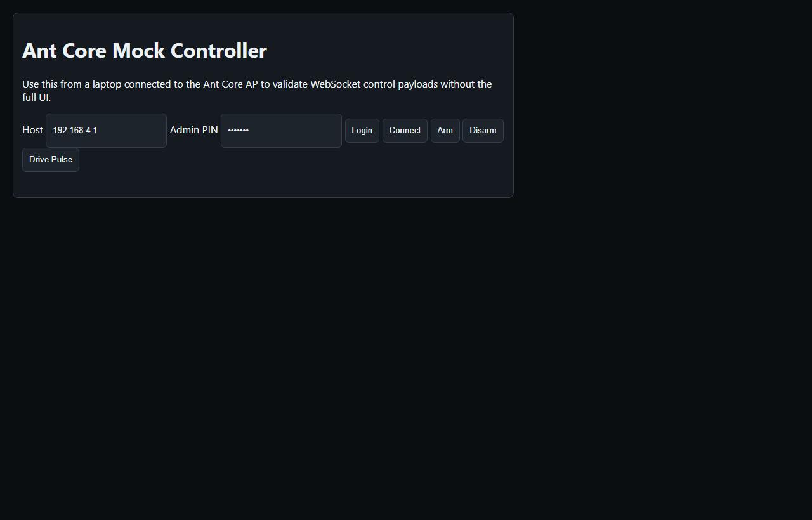

`tools/antcore_mock_controller.html` is a small WebSocket control test page. Open it in a browser connected to the Ant Core AP, enter the host and admin PIN, connect, claim control, and send a short drive pulse only when the robot is physically safe.

## Validation

Recommended local validation:

```powershell
python -m pytest
pio test -e native -f test_antcore_logic_native
python tools/antcore_ui_audit.py
python tools/antcore_serial_bridge.py --smoke
python tools/run_checks.py
```

Full repeatable checks:

```powershell
python tools/run_checks.py
```

`tools/run_checks.py` runs firmware build, boot-probe build, LittleFS build, native tests, Python tests, and the mock UI audit unless skipped with command-line flags.

## Project Layout

| Path | Purpose |
| --- | --- |
| `data/` | Web UI served from LittleFS |
| `docs/` | Hardware, setup, and recovery documentation |
| `docs/screenshots/` | README UI screenshots |
| `include/antcore_firmware_config.h` | Persisted config, telemetry, and controller structs |
| `include/antcore_board.h` | XIAO pin assignments and PWM channel mapping |
| `src/main.cpp` | Nine-line Arduino entry point |
| `src/antcore_app_*.cpp` | Lifecycle, robot control, input, storage, network, telemetry, logging and serial services |
| `src/antcore_routes_*.cpp` | HTTP route groups |
| `src/app/` | Application-internal state, grouped by owning service |
| `src/antcore_control_owner.cpp` | WebSocket ownership and control-source policy |
| `src/antcore_file_store.cpp` | Shared atomic file replacement |
| `src/antcore_config.cpp` | Defaults, JSON import/export, redaction, validation |
| `src/antcore_auth.cpp` | Admin PIN sessions, tokens, lockout-aware auth failures |
| `src/antcore_ble_input.cpp` | BLE Xbox input translation |
| `src/antcore_controls.cpp` | Control names, button/axis readers, calibration helpers |
| `src/antcore_sensors.cpp` | Battery ADC and BMI270 sampling |
| `src/antcore_outputs.cpp` | Motor PWM and servo output helpers |
| `src/antcore_output_test.cpp` | Live output test safety gates and pulse queues |
| `src/antcore_profiles.cpp` | Named profile save/load/delete |
| `src/antcore_packs.cpp` | Battery pack note storage |
| `src/antcore_safety.cpp` | Arming and runtime safety decisions |
| `src/antcore_serial.cpp` | Serial command parser and help text |
| `src/antcore_blackbox.cpp` | Persistent blackbox logging |
| `src/antcore_network.cpp` | Captive portal redirects and camera URL helpers |
| `src/antcore_logic.cpp` | Drive mixing, battery thresholds, macros, auto-invert, interlocks |
| `src/camera_stream.cpp` | Camera initialization, MJPEG stream, snapshot server |
| `test/` | Python and PlatformIO native tests |
| `tools/` | UI audit, serial bridge, FPV latency, and rig validation tools |

## Troubleshooting

Cannot open the setup page:

1. Join the `AntCore-XXXX` AP.
2. Browse to `http://192.168.4.1/`.
3. Try `http://antcore.local/` when on the same LAN.
4. Re-upload LittleFS with `pio run --target uploadfs`.

Arming is blocked:

1. Read the Dashboard safety banner or `safety.armBlockReason` from `/api/status`.
2. Change the default admin PIN.
3. Turn off pit mode.
4. Turn off mapping test mode.
5. Connect a fresh Xbox or web control source.
6. Fix battery critical or enable bench mode only for safe USB-only work.
7. Resolve config validation errors.
8. Wait for OTA to finish.

Controller will not pair:

1. Update the Xbox controller firmware.
2. Open Controller and press `Forget Controller`.
3. Press `Scan / Connect`.
4. Put the controller in pairing mode.
5. Keep the robot near the controller during pairing.

Battery reads `0.00 V`:

1. Check that a LiPo is fitted.
2. Check the 20k/10k divider and common ground.
3. Check the D8 sense wiring.
4. Use USB bench mode only for safe setup without a LiPo.

Camera stream unavailable:

1. Confirm the XIAO ESP32-S3 Sense camera is fitted.
2. Reboot the board.
3. Check `/api/status` camera fields.
4. Try lower frame size or higher JPEG compression from FPV -> Camera Settings.

Web assets look stale after OTA:

1. Upload filesystem separately from firmware.
2. Wait for reboot.
3. Hard-refresh the browser.
4. Clear browser cache if required.

After a fault or unexpected reset:

1. Open Dashboard and note Reset reason.
2. Open Diagnostics.
3. Export Log.
4. Export Blackbox.
5. Save the report before clearing logs or resetting config.


## Modular firmware maintenance

`src/main.cpp` is the Arduino entry point. Application services, their public
headers, internal state ownership, and the seven safety fixes are mapped in
[docs/architecture.md](docs/architecture.md). The source remains C++ to match the
Arduino libraries. HTTP route groups and the WebSocket protocol have separate
translation units; robot control runs on the main loop through its command queue.

The validation runner prefers PlatformIO's installed virtual environment and
accepts `--pio PATH`. Regression checks compile production runtime code with
hardware doubles and inject ownership/timeouts and file-save failures. These
checks complement the mock UI audit; they do not actuate connected hardware.
