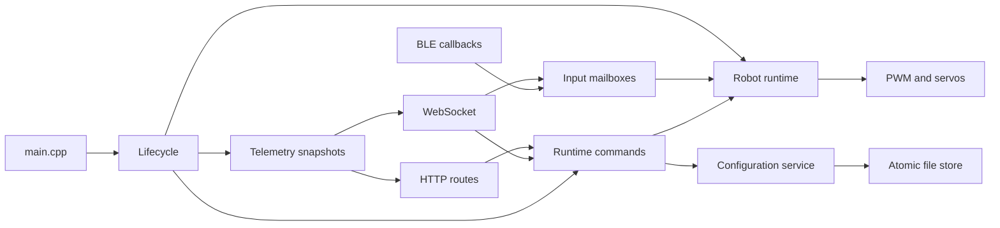

# Firmware architecture

Ant Core uses C++ (`.cpp` / `.h`) because its Arduino and device libraries are C++.
`src/main.cpp` only delegates Arduino's `setup()` and `loop()` to the application
lifecycle service. No implementation files are included into other `.cpp` files.

## Project map

| Area | Files | Responsibility |
| --- | --- | --- |
| Entry and scheduling | `src/main.cpp`, `src/antcore_app_lifecycle.cpp` | Boot order, boot guard, deferred peripherals, periodic work and reboot |
| Robot runtime | `src/antcore_app_robot.cpp` | Arm/disarm transitions, selected control source, weapon/macros, drive targets and servo commands |
| Input delivery | `src/antcore_app_inputs.cpp` | BLE callbacks and synchronized web/BLE mailboxes |
| Ownership policy | `include/antcore_control_owner.h`, `src/antcore_control_owner.cpp` | Connection-bound lease, frame freshness, generation and source selection, with no hardware dependencies |
| Safety policy | `include/antcore_safety.h`, `src/antcore_safety.cpp` | Arm gates and timeout decisions for the owner latched at arm time |
| Pure control calculations | `src/antcore_logic.cpp`, `src/antcore_controls.cpp` | Mixing, trim compensation, calibration and named controls |
| Output hardware and tests | `src/antcore_outputs.cpp`, `src/antcore_output_test.cpp` | PWM/servo adapter and bounded diagnostic pulses |
| Configuration service | `src/antcore_app_config.cpp`, `src/antcore_config.cpp` | Load/save, validation, defaults, serialization and profile application |
| Files and stores | `src/antcore_file_store.cpp`, `src/antcore_profiles.cpp`, `src/antcore_packs.cpp`, `src/antcore_blackbox.cpp` | Shared atomic commit and individual store formats |
| Wi-Fi | `src/antcore_app_network.cpp`, `src/antcore_network.cpp` | AP, STA, reconnect and captive-portal helpers |
| Web entry | `src/antcore_app_web.cpp` | Assets, common HTTP helpers and route registration |
| HTTP routes | `src/antcore_routes_*.cpp` | Separate auth, configuration, profiles/packs, control, logs, tests and OTA registrations |
| WebSocket | `src/antcore_app_ws.cpp` | Authenticated protocol, connection lifecycle and cached broadcasts |
| Commands | `src/antcore_app_commands.cpp` | HTTP/WebSocket-to-loop command queue and command execution |
| Telemetry | `src/antcore_app_telemetry.cpp` | Loop-built status/config snapshots; callbacks read serialized copies under a mutex |
| Peripherals | `src/antcore_app_peripherals.cpp`, `src/antcore_sensors.cpp`, `src/camera_stream.cpp` | Battery, IMU and camera integration |
| Logging and LEDs | `src/antcore_app_log.cpp`, `src/antcore_app_indicator.cpp` | Bounded log queues and status patterns |
| Serial | `src/antcore_app_console.cpp`, `src/antcore_serial.cpp` | Console command dispatch and parsing |
| Browser assets | `data/` | Dashboard, virtual controls, commissioning and diagnostics |
| Validation/tools | `test/`, `tools/` | Native logic tests, runtime regressions, browser audit, serial/rig tools |

Each application service has a matching public header in `include/`.
Implementation helpers are file-local. Application state lives in domain-specific
internal headers under `src/app/`; public headers do not export mutable state.
These are cooperating firmware services, not independently scheduled tasks.

## Execution and data ownership

The Arduino loop owns robot output changes and processes the runtime command
queue. BLE and web callbacks publish input through protected mailboxes. The web
mailbox keeps a complete frame, lease, connection ID and generation together.
Status/config JSON is built on the loop task and published under a mutex, avoiding
network callbacks walking or modifying live robot state. Network/auth and camera
libraries still have their own callbacks/tasks; this refactor does not claim that
all external library state is a single atomic snapshot.

HTTP route handlers authenticate and translate requests into commands. Existing
emergency `/api/disarm` access remains available without an admin token. Serial
commands execute on the loop task. Ordinary configuration/profile changes disarm
before changing output behaviour. Adding a route should not add motor writes to
a network callback.

## Safety invariants fixed by this refactor

1. Detach-on-disarm is idempotent: a detached servo stays detached until armed.
2. Motor trim is proportional gain compensation. `+0.10` means 10% more requested
   output before limiting; `-0.10` means 10% less. Zero and direction are preserved.
   Existing trim values should be retuned because the old code used an offset.
3. Arming latches the current source. A fresh backup controller cannot keep a
   stale owner armed. Web frames older than 250 ms stop outputs; after 750 ms the
   robot disarms. Owner release/disconnect/generation changes also disarm. Xbox
   uses its 1000 ms timeout. There is no armed fallback to another controller.
4. Every disarm cancels motor and servo test activity and deadlines, while leaving
   the operator's live-test enable preference intact. A new pulse requires a new
   explicit test command after rearming.
5. Each browser page generates its own random ID. The server also binds the lease
   to the actual WebSocket connection, so repeating another page's label cannot
   claim or publish its controls. A new owner starts with no frame. A claim-only
   heartbeat never freshens control data. A handover does not synthesize button
   press edges.
6. Persistent JSON writes create/flush/close a complete temporary file, then
   rename it over the destination without first deleting the old file. Short
   writes and rename errors retain the committed file. Uncommitted `.tmp` files
   are ignored on boot and replaced by a subsequent save. This relies on
   [LittleFS atomic rename guarantees](https://github.com/littlefs-project/littlefs#usage).
7. Tank inversion maps `(left, right)` to `(-right, -left)`, reversing translation
   while preserving steering handedness, consistently with arcade inversion.

## Verification

Run `python tools/run_checks.py`. It selects the installed PlatformIO virtual
environment where available; `--pio PATH` selects an explicit executable. A host
C++ compiler (`g++` on PATH), Python requirements, and Chrome/Edge are needed for
all checks. Builds do not flash the robot.

- PlatformIO builds firmware, the recovery boot probe, and LittleFS assets.
- Native Unity tests cover pure calculations, arm gates, ownership and rollover.
- `test/test_runtime_regressions.py` compiles production robot/output/storage code
  against deterministic hardware doubles in `test/support/`. It exercises loop
  transitions, repeated disarm, neutral trim, pulse cancellation, controller
  timeouts/reconnects, held buttons during handover, manual/IMU tank inversion,
  and simulated filesystem interruption/failures.
- The mock browser audit checks existing dashboard actions/layout plus distinct
  driver identities in simultaneous same-origin pages.
- Static contracts cover module boundaries, route registration/authentication,
  secret redaction, startup ordering and use of the shared storage helper. They
  deliberately do not assert exact README prose or presentation colours.

Hardware doubles do not verify electrical output timing, physical actuator
behaviour, BLE radio behaviour, or actual flash power interruption. Perform those
checks on a safely restrained rig before deploying to a fight robot.

## Review resolution checklist

| Review item | Implementation | Regression evidence |
| --- | --- | --- |
| Servo reattachment while disarmed | `antcore_outputs.cpp` branches on detach policy first | Runtime `servo` repeatedly ticks the disarmed production controller |
| Trim at neutral | `antcore_logic.cpp::compensateMotor` applies gain | Runtime `trim` verifies all outputs are zero and reverse direction is preserved |
| Backup masks owner timeout | `antcore_control_owner.cpp`, `antcore_safety.cpp`, `antcore_app_robot.cpp` | Runtime `timeout`, `reconnect`, `arrival`; Unity freshness/generation/wrap checks |
| Old output tests resume | `disarmRobot` calls `cancelOutputTests` before any early return | Runtime `cancel` rearms before the original motor/servo deadlines |
| Shared browser identity | Per-page random ID plus firmware connection binding | Same-origin iframe browser audit plus Unity same-label/different-connection checks |
| Delete-before-rename | Shared `antcore_file_store.cpp` commit helper | Runtime `storage` injects interruption at every modeled filesystem operation, short writes and rename/open failures |
| Tank inversion ignored | Mixer negates and swaps tank commands | Runtime `tank` covers manual and IMU inversion; Unity checks steering and neutral |

The `arrival` regression checks an input received while the loop consumes its
mailbox. Runtime time is sampled after those snapshots so a new frame cannot
underflow the unsigned age calculation and cause a false timeout.
